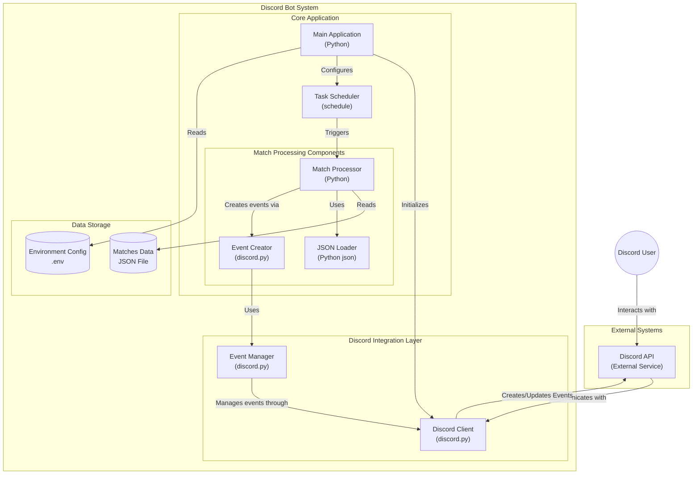

# Discord Event Bot

Este bot verifica partidas de CS2 e cria eventos no Discord com base em um arquivo JSON.

## Docker 

1. Crie um arquivo `.env` com as seguintes variáveis:
   ```
   DISCORD_TOKEN=DICORD_TOKEN
   DISCORD_GUILD_ID=DICORD_GUILD_ID
   CHANNEL_ID=CANAL_ID
   VOICE_CHANNEL_ID=VOICE_CHANNEL_ID
   CRON_INTERVAL_DAYS=1
   DESIRED_TEAMS_NAME=FURIA,paiN,Imperial,MIBR
   TIMEZONE_TZ=America/Sao_Paul
   ```

2. Execute o Docker Run:
   ```bash
   docker run --env-file .env --name discord-hltv-bot --restart on-failure -d lorthe/discord-hltv-matches:latest
   ```

## Configuração

1. Instale as dependências:
   ```bash
   python3 -m venv src/venv
   source src/venv/bin/activate
   pip install -r requirements.txt
   ```

2. Execute o bot:
   ```bash
   python3 -m src.app
   ```

# Arquitetura


